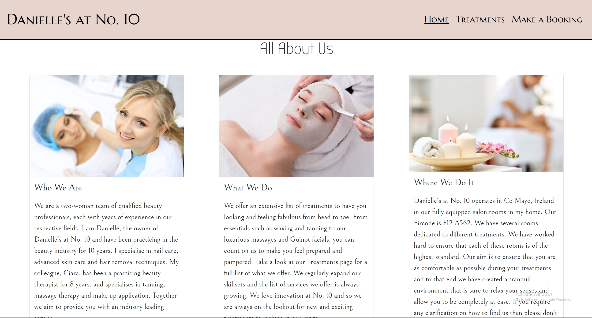
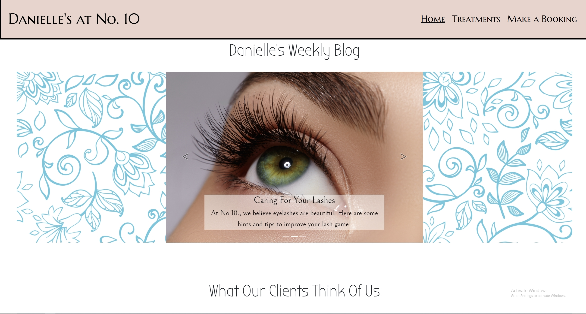
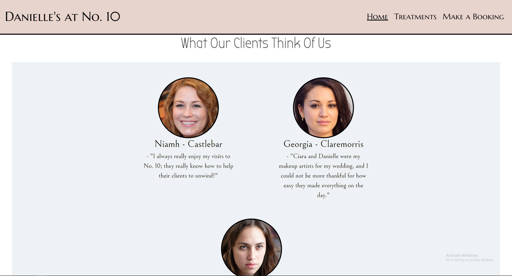
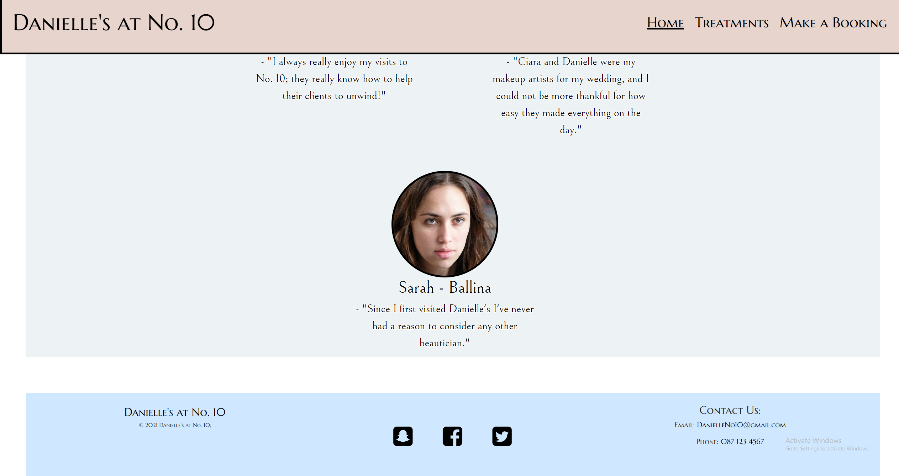
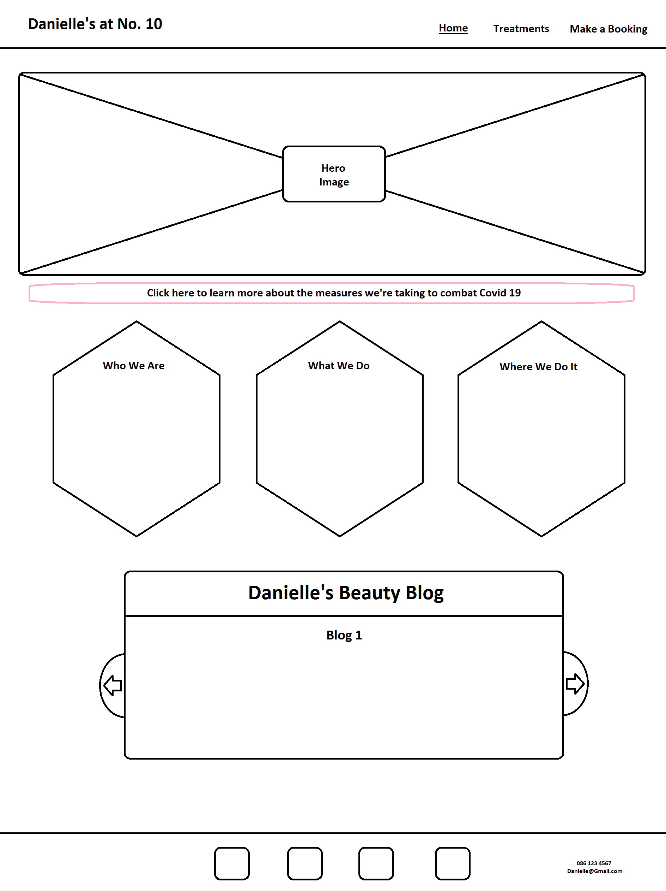
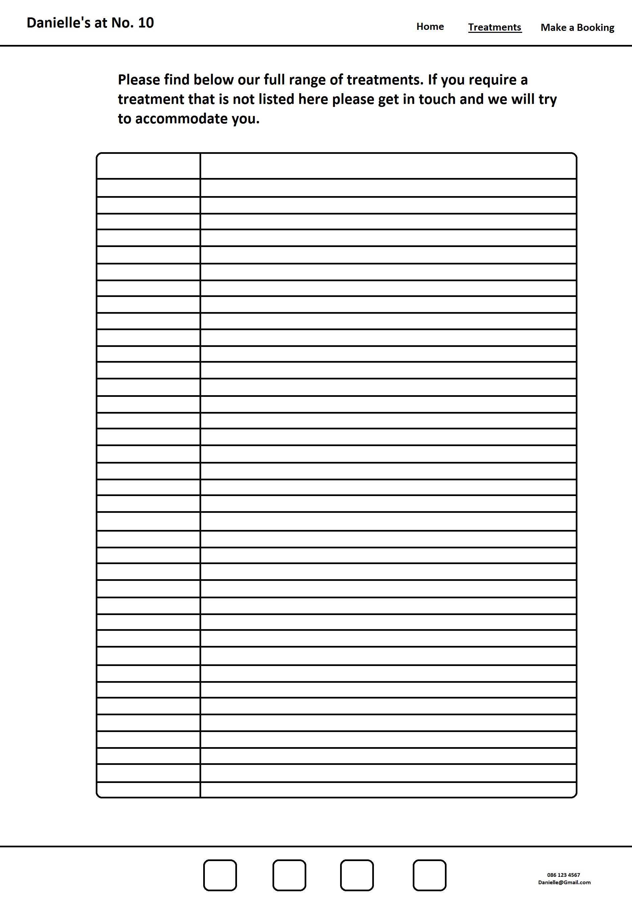
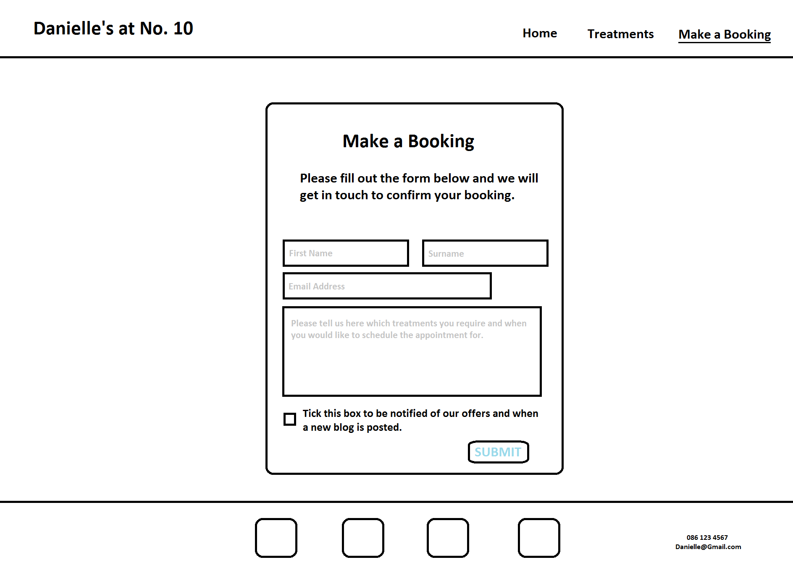

# Danielle's at No. 10 - Code Institute Milestone 1 Project

## Milestone Project 1 by Denis Hayes
---
* This project has been developed to fulfil the requirements of the Code Institute's Milestone Project 1.
* This project and its design parameters are based on the recently established business: 'Danielle's at No. 10'.
 * The business is owned and operated by a friend of mine, Danielle, (hereafter known as 'The Business Owner') and as such the project has been tailored to her requirements. 
 * The business consists of a beauty salon which operates in the business owner's residence, offering a variety of cosmetic treatments.
 * This project consists of a six page website; 3 main pages and 3 sub-pages to contain blog posts.
 
---
## Live Website Access
---
Access the live website at: https://dhayes23.github.io/Milestone-Project-1/

---
 ## Table of Contents
 ---
 1. Introduction
 2. Screenshots
 3. Website Requirements
    * Visitors' Needs
    * Business Owner's Needs
 4. Wireframes
 5. Features
    * Header
    * Hero Image
    * Covid-19 Information Banner
    * Hexagonal Information Cards
    * Blog
    * Footer
    * Table of Treatments
    * Booking Form
6. Upcoming Features
    * Custom Blog
    * Custom Booking System
7. Accessibility
8. Design Notes
9. Testing
10. Code Snippets
11. Deployment
12. Technologies Used
13. Bibliography
14. Acknowledgments

---
## Screenshots
---
Screenshots contained in README/assets/screenshots





---
## Website Requirements
---
Over the course of several phone interviews, the business owner and I discussed the main requirements of the website. We considered the needs of both the visitors to the site and the needs of the business owner herself. 

### **Visitors' Needs**
* The Visitor should be able to navigate the website confidently and easily using simple and conventional navigational controls, regardless of their technical proficiency. 
* The Visitor should be able to quickly and concisely understand the nature of the business and the types of services that it offers.  
* The Visitor should be able to easily view a detailed list of the services offered, the approximate duration of the services and the prices associated with the services. 
* The Visitor should be able to make direct contact with the business to create a booking.
* The Visitor should be informed of useful information about the business such as the business' contact information. 
* The Visitor should be encouraged to make repeat visits to the website independent of their need to make bookings or price inquiries. 
* The Visitor should find the website aesthetically pleasing, and in keeping with the themes of 'Relaxation' and 'Luxury'. 

### **Business Owner's Needs**
* The Business Owner aims to increase her brand awareness and the amount of bookings she receives, while also maximising the time that she can spend actually providing services in her salon.
* The Business Owner finds it more effective and less time-consuming to communicate with her clients via email rather than through phone line communication. For this reason it is important to the Business Owner that the Visitor be directed to use email communication first and foremost. 
* The Business Owner should be able to provide customers with a professional overview of her business, including information about the services provided and the general location of the business. 
* The Business Owner wants to engage with her clients and provide them with a reason to return to her website independent of their need to make bookings or price inquiries.
* The Business Owner wants her website to allow users to easily access her upcoming social media presences. 
* The Business Owner wants to provide the Visitor with reassurances that best practices are being adhered to regarding the ongoing Covid-19 pandemic.

--- 
## Wireframes
--- 
Wireframes contained in README/assets/wireframes



---
## Features
--- 
The Features of the project have been chosen based directly on the needs of both Visitors to the website and the Business Owner. 

Features are listed based on a top to bottom visual inspection of the website, starting with the 'Home' page(index.html) followed by the 'Treatments' page(treatments.html) and finally the 'Make a Booking' page(make-a-booking.html).

Feature's that repeat on separate pages of the website are described only once. 

### **Header**
* The Header has been designed to clearly display the name of the business: Danielle's at No. 10. 
* The Header contains a Nav Bar which directs to each of the three main pages of the website, 'Home', 'Treatments' and 'Make a Booking' using hyperlinks.
* In addition to the Nav Bar containing a link to the 'Home' page, the title of the business (Danielle's at No. 10) also acts as a hyperlink to the 'Home' page.
* The Header has been designed with a 'Fixed' position so that it remains at the top of the Visitor's screen, regardless of how far down the page the Visitor scrolls. This feature ensures that the Nav Bar is always visible to the Visitor. 
* The Nav Bar has been designed so that the Visitor can quickly ascertain which page of the website they are currently accessing. This is achieved with an 'active' tag and underlines the currently accessed page.  
### **Hero Image**
* The Hero Image has been designed to immediately convey to the Visitor the type of business that is being presented.
* The Hero Image conveys a message to the Visitor about an ongoing offer.
### **Covid-19 Information Banner**
* This banner has been included to provide an unobtrusive yet clearly visible avenue for the Visitor to learn about the business' Covid-19 response. 
* When clicked, the banner activates a modal. The modal displays a message from the Business Owner about the measures taken by the business to combat Covid-19. 
### **Information Cards**
* The Information Cards provide the Visitor with a brief overview of the business in an interactive and visually appealing way. 
* Using three separate cards to display the overview provides the Visitor with visually distinct sections to read. 
* Each of the cards answers a different question which the Visitor is likely to ask; Who are the operators of the business?(Who we are) What type of services does the business provide?(What we do.) Where is the business located?(Where we are.)
### **Blog Carousel**
* In order to promote habitual visitation, a blog has been implemented.
* Three blog hyperlinks are presented to the Visitor on a carousel which displays an image related to the content of the blog. 
* The hyperlinks navigate the Visitor to a separate page which contains the content of the blogs. 
### **Footer**
* The Footer contains links to the Business Owner's various social media accounts, allowing the Visitor to access all of the business' content from the website. 
* One of the Business Owner's aims is to reduce the amount of time that they spend on the phone, and increase the likelihood that clients will arrange bookings via email. While this aim is important to the Business Owner, her most important goal is to increase her overall business. To this end, the Footer contains a phone number and email address separate to the 'Make a Booking' page. This inclusion ensures that the Visitor is able to get in touch with the Business Owner using whichever means they prefer. 
### **Table of Treatments**
* The Table of Treatments displays the full range of treatments and services offered by the business, including their prices and the typical length of time the treatment takes to complete. 
* The rows of the table use alternating colours to increase the visibility of each item. 
### **Booking Form**
* The Booking Form allows the Visitor to get in touch with the Business Owner and arrange a treatment. 
* The Booking Form includes prompts for the Visitor using the 'Placeholder' attribute. When the user inputs their details into the presented fields, the placeholder text disappears. 
* The Booking Form detects whether all required fields have been filled and does not allow the form to be submitted unless they have been. 
* The Booking Form detects whether the email inputted by the user is in the valid format using the 'type=email' attribute. 
 * The Booking Form includes a checkbox, allowing the Visitor to sign up to a mailing list. 

 ---
 ## Upcoming Features
 ---
 ### **Custom Blog**
* When I acquire the skills to develop a custom interface, I will implement an updated Blog feature for the Business Owner to use.
* Using this interface the Business Owner will be able to simply access the site and add an image to be added to the blog carousel and heading as well as the written content of the blog using an easy to use interface.
* The updated Blog will eliminate the current dependence on an outside provider for the interface.
### **Functional Form**
* When I acquire the skills to make the form functional I will do so, unless I implement the following feature before that time. 
 ### **Custom Booking System**
 * When I acquire the skills to develop a back end system to handle bookings I will design a Custom Booking System.
 * The Custom Booking System will allow the Visitor to select the treatment/s that they wish to book and input them into the system. At this point the system will determine the length of time the treatment/s will take and check if the Visitor's chosen time slot is available. 
 * If the system determines that the appointment can be made it will be automatically added to the Business Owner's schedule. 
 * When the appointment is made, the system will notify both the Visitor and the Business Owner that the booking has been completed.

---
 ## Accessibility
 ---
### **Current Accessibility Features**
* All non-background images have been given a detailed 'alt' attribute, thereby allowing screen readers to provide an audio description of the content. 
* The ARIA hidden attribute has been used to hide elements that would be disruptive to screen readers. 
* The Covid-19 Information pop-up has been designed to only activate when the Banner is clicked, thereby ensuring that the Visitor has full control over if/when the pop-up is displayed. 

### **Upcoming Accessibility Features**
* When I implement the aforementioned Custom Blog and Custom Booking System, I will design them to be fully navigable when using only a keyboard interface.
* Some background images do not have an alt description. I aim to research the possibility of using an alternative method describe this content. 
---
## Design Notes
---
### **Layout**
* The website uses a simple three page layout. Separating the website into three distinct sections allows for clear, easy navigation even if the Visitor is not a regular internet user. 
* Each page has been named descriptively so as to allow easy navigation on first time use. 
* The Home page uses different shapes and background colours to achieve separation of the content. 
* The Treatments and Make a Booking pages are each dedicated to a single feature only, thereby simplifying the treatment and booking enquiry process for the Visitor. 
### **General Aesthetics**
* The website has 
### **Colour Scheme**
* In order to foster a sense of relaxation and calmness, the website has been styled using a number of soft pastel colours. 
* Light pinks and blues are the predominant hues throughout the website, with an emphasis on creating a spa-like atmosphere. 
---
## Testing
---
### **Functionality - index.html**

* Tested Nav Bar links by clicking each of them. All Nav Bar links functional. 
* Tested Nav Bar active attribute by observing nav-item text decoration on each page. All Nav Bar active attributes functional. 
* Tested Nav Bar burger menu by clicking on it when the screen size was reduced. Nav Bar burger menu functional. 
* Tested Covid-19 modal button. Modal displays correctly on button click. Modal and modal button functional.
* Tested Blog Carousel controls and hyperlinks by clicking each button and link. All controls and links functional. 
* Tested Social Icon links by clicking on each. Each icon links to external website and opens in a separate tab. All Social Icons functional. 
* Tested mailto:email link by clicking on it. Link correctly opens mail service in separate tab. Link functional.
* Tested telephone number link by clicking on it. Link correctly opens browser phone service. Link functional. 

### **Functionality - make-a-booking.html**
* Tested all form elements for validation by typing valid and invalid answers into each input. Inputs responded correctly. All inputs functional.
* Tested placeholder text by typing in associated forms. Placeholder text disappears upon user input. Placeholder text functional. 

### Browser **Compatibility**
* Site tested on Chrome, Firefox and Safari. Site performed identically on each browser. Site is compatible with all tested browsers. 

### **Responsiveness**
* Website tested on varying screen sizes. Elements expand/contract as expected, as per defined @media queries and according to the defined Bootstrap Grid. 

### **Tested User Stories - The Visitor**
* The Visitor is able to navigate effectively using the simple navigation controls. 
* The Visitor can quickly ascertain the nature of the business based on the imagery provided and the clearly defined 'All About Us' section. 
* The Visitor may visit treatments.html for a complete list of available services. 
* The Visitor can make direct contact with the business either using the contact links in the footer or by visiting make-a-booking.html and filling out the presented form. 
* The Visitor can find the business' contact information in the footer. 
* The Visitor is encouraged to make repeated visits to the website to read the weekly blog.
* The Visitor is entreated to find the website aesthetically pleasing by the soothing colours and gentle, relaxing imagery used. 

### **Tested User Stories - The Business Owner**
* The Business Owner's brand is enhanced by the inclusion of positive imagery and detailed information about the business being presented in the 'All About Us' section.
* The Business Owner can spend additional time providing services in her salon as the websites draw the Visitor to communicate electronically. 
* The Business Owner's location is readily available in the 'Where We Do It' info card, and a comprehensive list of available services exists in treatments.html. 
* The Business Owner has a means to engage with her clients through the use of the 'Danielle's Weekly Blog' section. This section also provides the Visitor with a reason to keep checking in with the website. 
* The Business Owner's social media presences are available to the Visitor through the use of the Social Icons contained in the footer of each page within the website.
* The Business Owner can reassure the Visitor that the business is adhering to best practices regarding Covid-19 through the Visitor's use of the Covid-19 modal. The modal is highly visible yet unobtrusive and delivers a reassuring message to the Visitor about the business' handling of the pandemic. 

---
## Code Snippets
---
### **Blog Carousel Controls**
 The following CSS snippet for styling the Blog section's carousel controls was found at 'https://stackoverflow.com/questions/46249541/change-arrow-colors-in-bootstraps-carousel' and has been altered for my use.

```
.carousel-control-prev-icon,
.carousel-control-next-icon {
  height: 100px;
  width: 100px; 
  outline: rgb(0, 0, 0);
  background-size: 100%, 100%;
  border-radius: 50%;
  background-image: none;
}

.carousel-control-next-icon:after
{
  content: '>';
  font-size: 55px;
  color: rgb(0, 0, 0);
  text-shadow: -1px -1px rgb(255, 255, 255), 1px -1px rgb(255, 255, 255), -1px 1px rgb(255, 255, 255), 1px 1px   rgb(255, 255, 255);
}

.carousel-control-prev-icon:after {
  content: '<';
  font-size: 55px;
  color: rgb(0, 0, 0);
  text-shadow: -1px -1px rgb(255, 255, 255), 1px -1px rgb(255, 255, 255), -1px 1px rgb(255, 255, 255), 1px 1px   rgb(255, 255, 255);

}
```

---
## Deployment
---
### **The following steps were taken to deploy the website.**
* 1. Github Login: Using an existing Github account, log into the website. 
* 2. Navigate to Settings in Github: Click the 'Settings' button. 
* 3. Change Repository Visibility(Necessary only if repository is private): Scroll to the end of the settings menu. At the bottom of the menu find the 'Danger Zone'. Click on the 'Change Repository Visibility' button. Select the 'Make Public' radio button. Type username and repository name into text box as prompted. Click 'I understand, change repository visibility' button. 
* 4. Still in the settings menu, navigate to the Github Pages. Locate the 'Source' section. Use the dropdown menu to select 'Master Branch'.
* 5. The website is now published. Again in the Github Pages section, find the url of the website.  
---
## Technologies Used
---
### **Bootstrap 4.6**
* Bootstrap 4.6 has been used for both its grid system and for several components such as the Blog carousel and the Covid-19 modal, both found in index.html.
### **Font Awesome 4.7**
* Font Awesome 4.7 provided all of the icons used within this project. Examples include the Nav Bar's burger menu icon and the Footer's social media icons. 
### **ThisPersonDoesNotExist<.com>**
* ThisPersonDoesNotExist<.com> provided the randomly generated client images.
### **SimpleImageResizer<.com>**
* SimpleImageResizer<.com> was used to resize some images that would otherwise have been too large to use. 
### **Cooolers<.co>**
* Cooolers<.co> was used to design a colour palette for the website. 
### **Microsoft Paint**
* Microsoft Paint was used to develop the initial wireframes of the website.
### **Github Pages**
* Github Pages was used to deploy the website.
---
## Bibliography
---
### **Websites**
* W3schools.com. 2021. W3Schools Online Web Tutorials. [online] Available at: <https://www.w3schools.com/> [Accessed 28 February 2021].
* Traversymedia.com. 2021. Traversy Media | Web Development & Programming Tutorials. [online] Available at: <https://www.traversymedia.com/> [Accessed 28 February 2021].
* Mark Otto, a., 2021. Introduction. [online] Getbootstrap.com. Available at: <https://getbootstrap.com/docs/4.6/getting-started/introduction/> [Accessed 28 February 2021].

---
## Acknowledgments
---
### **Brian Macharia, Code Institute Mentor**
I would like to thank my mentor, Brian, for his invaluable advice and assistance with the realisation of this project. 
### **Alexander, Code Institute Student Care Team**
I would like to thank Alexander and the rest of the Student Care Team for their work behind the scenes to ensure that students have the opportunity to work to the best of their abilities. 
### **Aisling Molloy, Researcher**
I would like to thank Aisling for her assistance with beauty treatment research. 
